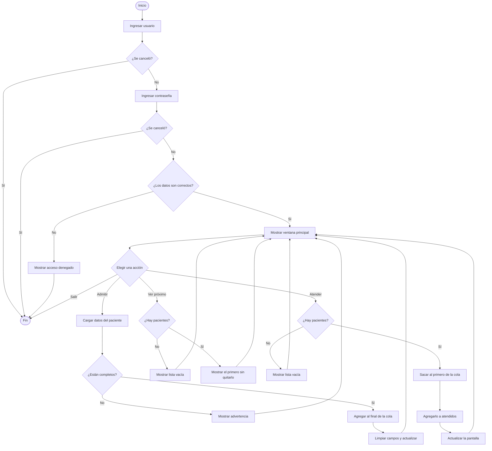

# SISTEMA DE GUARDIA HOSPITALARIA

Trabajo realizado por González Fátima, González Guillermina y Gasparetto Gerónimo.

Este proyecto es un sistema sencillo para organizar los turnos de una guardia hospitalaria. Fue hecho en C++ usando Qt Creator y Qt Designer para armar la interfaz.

La idea del programa es cargar pacientes y atenderlos según el orden en el que llegaron. El primero que entra a la cola es el primero que se atiende.

## Qué se puede hacer

- Ingresar al sistema con usuario y contraseña.
- Cargar un paciente con sus datos.
- Ver los pacientes que todavía no fueron atendidos.
- Consultar quién es el próximo paciente.
- Atender al primero de la cola.
- Ver la lista de pacientes que ya fueron atendidos.
- Salir del programa.

## Inicio de sesión

Cuando se abre el programa se pide un usuario y una contraseña.

```text
Usuario: grupo2
Contraseña: utnfrh
```

El usuario se tiene que escribir en minúsculas y sin espacios. Si alguno de los dos datos es incorrecto aparece un mensaje de acceso denegado y el programa se cierra.

## Ingreso de pacientes

En la parte **Ingreso de paciente** se completan estos datos:

- Nombre y apellido.
- Edad.
- Género.
- DNI.

La edad tiene que ser mayor que cero y el DNI acepta solamente números, con un máximo de 8 dígitos. También se debe elegir una opción de género.

Después se presiona el botón **Admitir paciente**. Si falta algún dato aparece una advertencia. Si está todo completo, el paciente se agrega al final de la cola y los campos quedan vacíos para poder cargar otro.

## Cola de espera

Para guardar a los pacientes que todavía no fueron atendidos usamos:

```cpp
QQueue<Paciente> colaEspera;
```

`QQueue` funciona como una cola FIFO (*First In, First Out*), es decir, el primero que entra es el primero que sale. Esto sirve para respetar el orden de llegada de los pacientes.

Cuando se admite a uno nuevo se usa:

```cpp
colaEspera.enqueue(nuevoPaciente);
```

`enqueue()` lo agrega al final de la cola.

## Ver el próximo paciente

El botón **Ver próximo** muestra los datos del paciente que está primero, pero no lo saca de la cola.

```cpp
const Paciente &paciente = colaEspera.head();
```

`head()` solamente consulta el primer elemento. Si no hay pacientes, el programa muestra un aviso de lista vacía.

## Atender un paciente

El botón **Atender** saca al primer paciente de la cola:

```cpp
Paciente pacienteAtendido = colaEspera.dequeue();
```

Después lo agrega a la lista de atendidos:

```cpp
listaAtendidos.append(pacienteAtendido);
```

La lista está declarada así:

```cpp
QList<Paciente> listaAtendidos;
```

De esta forma se mantiene el orden en el que fueron atendidos.

## Datos de cada paciente

Cada paciente se representa con una estructura:

```cpp
struct Paciente
{
    QString nombreApellido;
    int edad;
    char genero;
    QString dni;
};
```

La estructura guarda el nombre y apellido, la edad, el género y el DNI.

## Actualización de la pantalla

Cada vez que se admite o se atiende un paciente se llama a esta función:

```cpp
actualizarPantalla();
```

Esta función vuelve a mostrar:

- Los pacientes que siguen esperando.
- Los pacientes que ya fueron atendidos.
- El próximo paciente.
- La cantidad de pacientes de cada lista.

Los pacientes se ven con un formato parecido a este:

```text
1. María González - Edad: 25 - Género: F - DNI: 12345678
2. Juan Pérez - Edad: 42 - Género: M - DNI: 23456789
```

## Funcionamiento general



## Interfaz

La ventana fue armada con Qt Designer y está separada en partes simples:

- Ingreso de paciente.
- Próximo paciente.
- Pacientes sin atender.
- Pacientes atendidos.
- Botón para salir.

Se usaron colores claros relacionados con un hospital: fondo celeste muy claro, encabezado turquesa, campos blancos y algunos botones en celeste o verde. Los textos de la ventana principal son negros para que se lean bien. Las ventanas de aviso tienen texto blanco y el botón **OK** conserva texto negro.

También se usaron layouts para que los elementos queden ordenados cuando cambia el tamaño de la ventana.

## Archivos del proyecto

```text
QT-GuardiaHosp/
├── main.cpp
├── mainwindow.h
├── mainwindow.cpp
├── mainwindow.ui
├── QT-GuardiaHosp.pro
└── README.md
```

- `main.cpp`: inicia el programa, pide el usuario y la contraseña y abre la ventana principal.
- `mainwindow.h`: declara la ventana, la estructura `Paciente`, la cola y la lista de atendidos.
- `mainwindow.cpp`: contiene las funciones de los botones y la lógica del programa.
- `mainwindow.ui`: guarda el diseño de la interfaz hecho con Qt Designer.
- `QT-GuardiaHosp.pro`: configura el proyecto para compilarlo con qmake.
- `README.md`: explica de manera general cómo funciona el trabajo.

## Conceptos usados

- Estructuras (`struct`).
- Variables y tipos de datos.
- Funciones.
- Condicionales `if`.
- Ciclos `for`.
- Cola `QQueue`.
- Lista `QList`.
- Señales y slots de Qt.
- Mensajes con `QMessageBox`.
- Entrada de datos con `QInputDialog`.
- Organización de la interfaz con layouts.

## Autores

González Guillermina, González Fátima y Gasparetto Gerónimo.

Bioingeniería - UTN Facultad Regional Haedo - Programación II.
